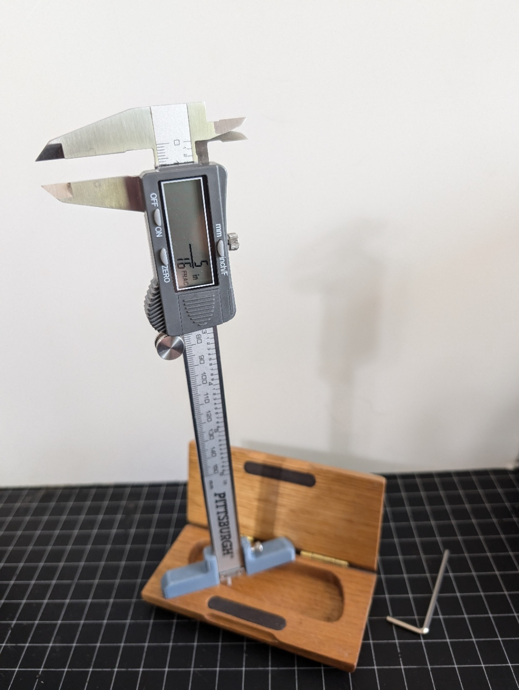
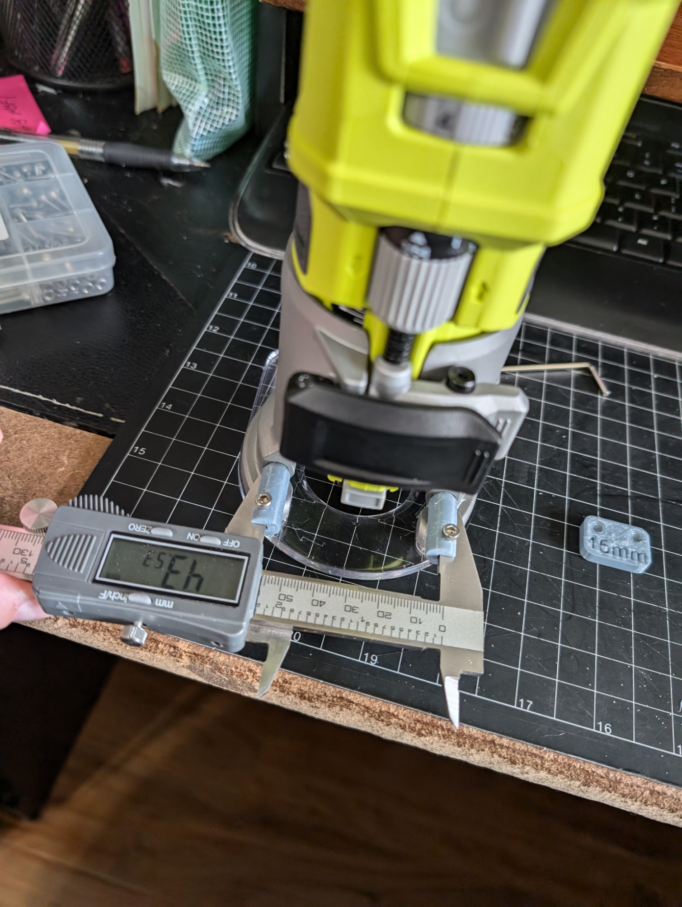
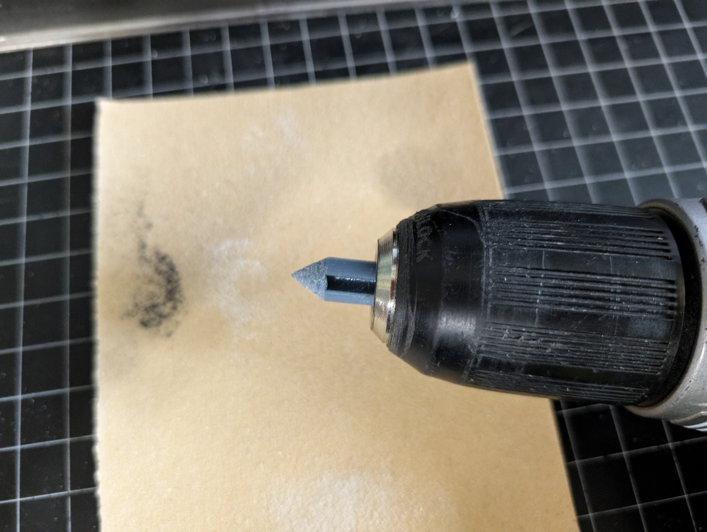

# PittsburghCaliperAccessories
3D Printable accessories to add new functionality to Harbor Freight's Pittsburgh Calipers.  These were designed and tested on Item # 62569, the grey six inch Metric, Decimal Inch, and Fractional inch model.  The center-to-center tool also fits the older black six inch Metric and Decimal Inch model, but it needs some additional clearance to fit the depth base. I don't have an item # for this model.

This set currently includes:
* Depth Measuring Base
* Pins for measuring the center-to-center distance of holes

## Depth Measuring Base Instructions

* Print "Depth Measuring Base.3mf"
* * Recommended Material: Prusament PETG ~ 6 Grams
* * Print at 0.3mm "Draft" settings
* * No support material required
* Start 1 M3x8mm Socket Head Cap Screw in the side hole, but do not fully tighten it.
* * https://amzn.to/3WaNcua
* Place the Caliper in the slot, rotating it slightly.
* Place the Caliper and base on a reference surface, insuring the plunger is even with the bottom of the base.
* Gently tighten the retaining screw to hold the caliper in place.
* Place the Caliper and base back the reference surface, and extend the plunger until it makes firm contact with the surface.  Then zero the calipers.
* Measurements can be directly read from the tool.

## Center-to-Center Measuring Pins

* Print "C2C Pin - Original.3mf", "C2C Pin - Mirror.3mf", and "C2C Pin - Original.3mf"
* * Recommended Material: Prusament PETG ~ 6 Grams
* * Print at 0.3mm "Draft" settings
* * No support material required
* * * If your pin points print with a slight deformation at the end of the pin, these can be sanded to smooth and concentric by centering them carefully in a drill chuck and spinning against sandpaper.

* The pins are designed to be a light friction fit on the caliper jaws. Screw holes are provided for (2) optional M3x5mm Socket Head Cap Screws to retain the jaws.
* Once the pins are installed, place them in the calibration jig and zero the caliper.  Hole center-to-center distances will be 15mm *MORE* than the measurement shown on the calipers.
* * __Add 15mm from the measurement to get the actual center-to-center distance__
* * A caliper reading of 43.5MM will indicate a center-to-center distance of 43.5+15=58.5mm

## Suggestions for future work
* Make knobs for the retaining screws
* Make a modified V base for measuring curve radius
* * Perhaps in different sizes?
* Custom Caliper jaws for directly measuring offsets, like McMaster https://www.mcmaster.com/20095A31/
* A case or pockets in the depth base to hold the accessories so they don't wander off
* Magnets? to hold the pins in place on the calipers?
* Tightening the depth base screw deflects the base and can cause the calipers to pop out.  Perhaps a compliant mechanism and/or wedge shape could help with this?
* Simplify the models to allow making them on a lathe or mill
* There is an electrical connector on the side adjacent to the battery door.  Research and/or Reverse engineer that, make a connector for it, and create a PC adapter.
* Create a script to export all of the bodies as STL and 3MF AND iterate through all of the available sizes.

## 2024/07/28 Updates
* Done - Add additional clearance to depth gauge to fit black calipers.
* Done - Make the C2c calibration jig holes through holes so they work better.
* Done - Make the depth base available in different lengths
* * The length is now parameterized in Fusion
* * Pregenerated 3MFs for 150mm and 75mm
* * * I'm concerned that parts longer than 150mm may have issues with warming and/or deflection.